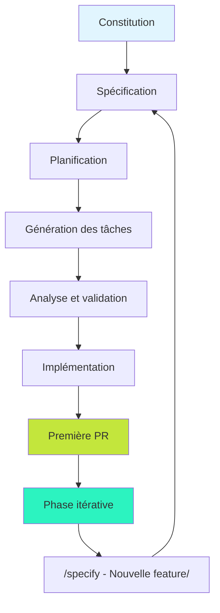
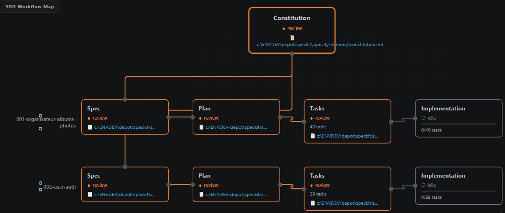

## 🚀 Démo en ligne

Une version déployée du projet est disponible sur GitHub Pages :

👉 **https://jerougui.github.io/speckit/**

Cela permet de visualiser rapidement le rendu sans installation locale.


# Organisateur d'Albums Photos - Spec Kit Process

Un exemple d'application web pour organiser des photos par albums, développée selon le processus **Spec Kit**.

## Vue d'ensemble du processus Spec Kit

Spec Kit est une méthodologie de développement logiciel qui combine :
- **Library-First** : Architecture modulaire et composable
- **Test-First** : Développement piloté par les tests
- **Functional Design** : Approche fonctionnelle
- **Composable Independence** : Modules indépendants
- **Pragmatic Simplicity** : Simplicité pragmatique

## Schéma du processus




## Phase 1 : Construction initiale

### 1. Constitution (`/speckit.constitution`)
- Définition des principes de développement
- Création du fichier `specs/constitution.md`
- Établissement des règles de gouvernance

### 2. Spécification (`/speckit.specify`)
- Description naturelle de la fonctionnalité
- Génération de `specs/001-organisateur-albums-photos/spec.md`
- Définition des user stories et exigences

### 3. Planification (`/speckit.plan`)
- Analyse technique et architecture
- Création de `specs/001-organisateur-albums-photos/plan.md`
- Choix des technologies et structure

### 4. Génération des tâches (`/speckit.tasks`)
- Décomposition en tâches actionnables
- Création de `specs/001-organisateur-albums-photos/tasks.md`
- Ordonnancement et dépendances

### 5. Analyse (`/speckit.analyze`)
- Validation croisée des artifacts
- Vérification de la cohérence
- Identification des gaps

### 6. Implémentation (`/speckit.implement`)
- Exécution des tâches selon le plan
- Développement TDD (Test-Driven Development)
- Validation continue

### 7. Première Pull Request
- Code complet et testé
- Documentation à jour
- Prêt pour review et déploiement

## Phase 2 : Développement itératif

Après la première release, le développement continue de manière itérative :

1. **Nouvelle fonctionnalité** : `/speckit.specify "nouvelle feature"`
2. **Reprise du cycle** : Spécification → Plan → Tâches → Analyse → Implémentation
3. **Intégration continue** : Chaque itération produit une PR
4. **Évolution progressive** : Amélioration continue selon les principes

## Structure du projet

```
speckit/
├── .specify/                    # Configuration Spec Kit
│   └── memory/
│       └── constitution.md      # Principes de développement
├── specs/                       # Spécifications et plans
│   └── 001-organisateur-albums-photos/
│       ├── spec.md             # Spécification fonctionnelle
│       ├── plan.md             # Plan technique
│       ├── tasks.md            # Tâches d'implémentation
│       ├── data-model.md       # Modèle de données
│       ├── contracts/          # Contrats d'interface
│       └── research.md         # Recherches et décisions
├── src/                        # Code source
│   ├── lib/                    # Modules métier
│   ├── ui/                     # Composants interface
│   └── main.js                 # Point d'entrée
├── tests/                      # Tests
└── package.json               # Dépendances
```
# 🧩 Description détaillée des étapes Spec‑Kit  
### …et ce qui est attendu de vous à chaque étape

Chaque étape produit un artefact et nécessite une **validation humaine** avant de passer à la suivante.

---

## **1. Constitution — `/speckit.constitution`**

### 🎯 Objectif  
Définir les principes fondamentaux du projet.

### 📄 Produit  
`specs/constitution.md`

### 🧠 Ce qui est attendu de vous  
- Vérifier que les principes correspondent à votre vision  
- Ajuster les règles si elles sont trop vagues ou trop strictes  

### 🔎 Comment relire  
- Les règles sont‑elles applicables ?  
- Y a‑t‑il des contradictions ?  
- Le document est‑il compréhensible par un autre développeur ?

---

## **2. Spécification — `/speckit.specify`**

### 🎯 Objectif  
Décrire la fonctionnalité en langage naturel.

### 📄 Produit  
`specs/<feature>/spec.md`

### 🧠 Ce qui est attendu de vous  
- Lire la spec comme un Product Owner  
- Vérifier que rien n’est oublié  
- Clarifier les zones floues  

### 🔎 Comment relire  
- Les user stories couvrent‑elles tous les cas ?  
- Les comportements sont‑ils bien définis ?  
- Les exemples sont‑ils suffisants ?

---

## **3. Planification — `/speckit.plan`**

### 🎯 Objectif  
Transformer la spec en un plan technique.

### 📄 Produit  
`plan.md`, `data-model.md`, `contracts/`, `research.md`

### 🧠 Ce qui est attendu de vous  
- Vérifier la cohérence technique  
- Ajuster les choix d’architecture  
- Ajouter les contraintes non mentionnées  

### 🔎 Comment relire  
- Le modèle de données est‑il complet ?  
- Les flux sont‑ils cohérents ?  
- Les décisions techniques sont‑elles réalistes ?

---

## **4. Génération des tâches — `/speckit.tasks`**

### 🎯 Objectif  
Décomposer la feature en tâches actionnables.

### 📄 Produit  
`tasks.md`

### 🧠 Ce qui est attendu de vous  
- Vérifier que les tâches sont réalisables  
- Ajouter/retirer des tâches si nécessaire  
- Confirmer l’ordre logique  

### 🔎 Comment relire  
- Chaque tâche est‑elle testable ?  
- Les dépendances sont‑elles correctes ?  
- Rien d’important n’a‑t‑il été oublié ?

---

## **5. Analyse & validation — `/speckit.analyze`**

### 🎯 Objectif  
Vérifier la cohérence globale.

### 📄 Produit  
`review.md`

### 🧠 Ce qui est attendu de vous  
- Lire les remarques  
- Corriger les incohérences  
- Confirmer que tout est prêt pour l’implémentation  

### 🔎 Comment relire  
- Les fichiers se contredisent‑ils ?  
- Les tâches couvrent‑elles toute la spec ?  
- Le plan est‑il réalisable ?

---

## **6. Implémentation — `/speckit.implement`**

### 🎯 Objectif  
Générer le code initial et commencer le développement.

### 📄 Produit  
- Squelettes de fichiers  
- Tests TDD  
- Modules initiaux

### 🧠 Ce qui est attendu de vous  
- Ajuster le code généré  
- Compléter les parties manquantes  
- Exécuter les tests  

### 🔎 Comment relire  
- Le code respecte‑t‑il la spec ?  
- Les tests couvrent‑ils les cas importants ?  
- Le style est‑il cohérent ?

---

## **7. Première Pull Request**

### 🎯 Objectif  
Finaliser la feature.

### 🧠 Ce qui est attendu de vous  
- Vérifier que tout est testé  
- Vérifier que la documentation est à jour  
- Ouvrir une PR propre et lisible  

---

## **8. Phase itérative**

### 🎯 Objectif  
Améliorer, corriger, étendre.

### 🧠 Ce qui est attendu de vous  
- Utiliser `/speckit.specify` pour chaque nouvelle feature  
- Reprendre le cycle complet  

## Technologies utilisées

- **Frontend** : JavaScript ES2024+, HTML5, CSS3
- **Build** : Vite 5.4+
- **Base de données** : SQLite via sql.js (WebAssembly)
- **Tests** : Vitest + happy-dom
- **Persistance** : IndexedDB pour les métadonnées et fichiers

## Fonctionnalités implémentées

- ✅ Création et gestion d'albums
- ✅ Organisation des photos par date
- ✅ Affichage en mode tuile
- ✅ Drag & drop pour réorganiser les albums
- ✅ Stockage local (pas de cloud)
- ✅ Interface française
- ✅ Persistance des données après refresh

## Démarrage rapide

```bash
# Installation
npm install

# Développement
npm run dev

# Tests
npm test

# Build de production
npm run build
```

Ouvrir `http://localhost:5173` dans un navigateur moderne.

## Principes Spec Kit appliqués

### Library-First Architecture
- Modules composables dans `src/lib/`
- Séparation claire des responsabilités
- Interfaces cohérentes

### Test-First Development
- Tests unitaires et d'intégration
- Couverture complète des fonctionnalités
- Validation automatique

### Functional Design
- Fonctions pures privilégiées
- Immutabilité des données
- Composition plutôt qu'héritage

### Composable Independence
- Modules indépendants testables séparément
- Injection de dépendances
- Contrats d'interface clairs

### Pragmatic Simplicity
- Code simple et lisible
- Solutions adaptées au contexte
- Évitement de l'over-engineering

## Contribution

Ce projet suit le processus Spec Kit :

1. `/speckit.specify "votre nouvelle fonctionnalité"`
2. Suivre le cycle complet : plan → tâches → analyse → implémentation
3. Créer une PR avec tests et documentation

## 📚 Références

- Documentation officielle Spec‑Kit : https://github.github.com/spec-kit/index.html  
- Méthode BMAD (méthodologie similaire) : https://docs.bmad-method.org/fr/

## Licence

MIT</content>
<parameter name="filePath">c:\ENVDEV\depot\speckit\README.md